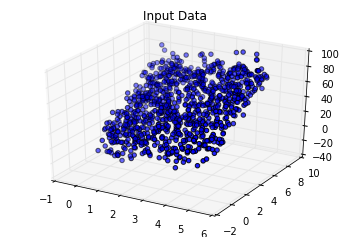
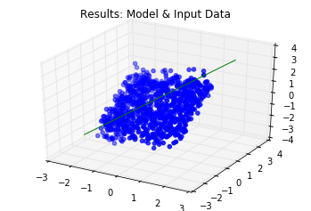
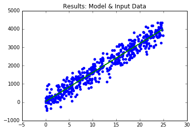
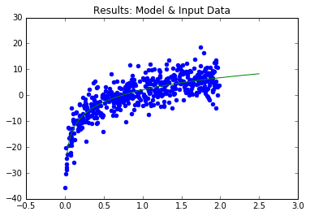
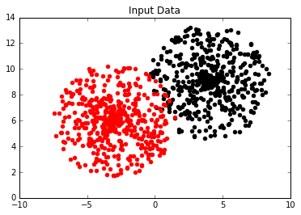
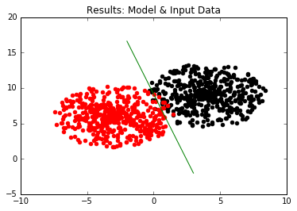

# Linear and Logistic Regression in Python using TensorFlow

## Structure.
<pre>
	/practice 		  - Exercises
	/basic-tensorflow - The Basic & Lab manual
	
</pre>









## Downloads
- All: https://github.com/nextco/linear-and-logistic-regression/archive/master.zip

## Install Requirements
```shell
pip install -r requirements.txt
```

## Extra info
To save requirements.txt on Anaconda Windows
```shell
pip install pipreqs
pipreqs --encoding=utf-8 --force .
```